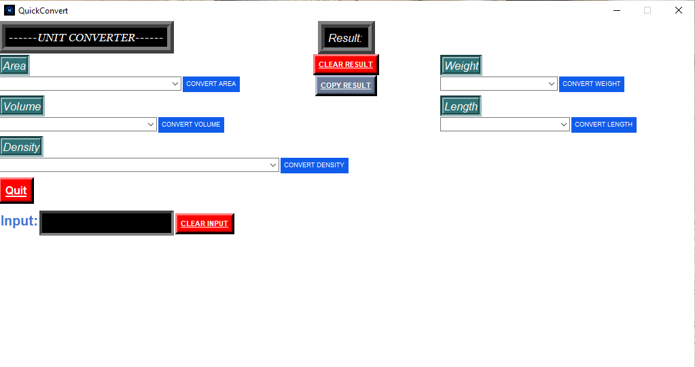
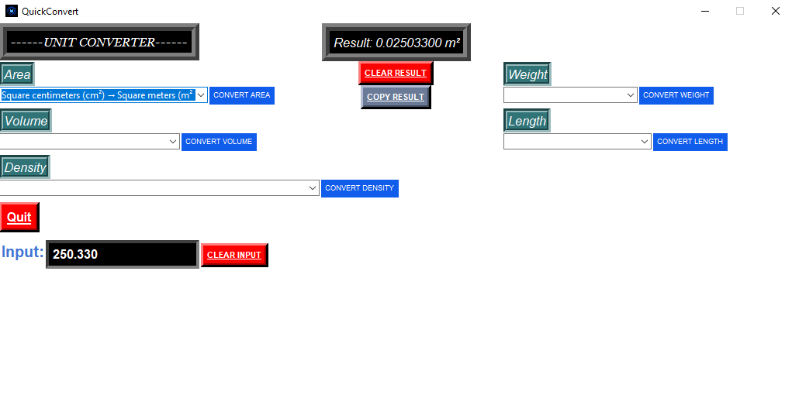
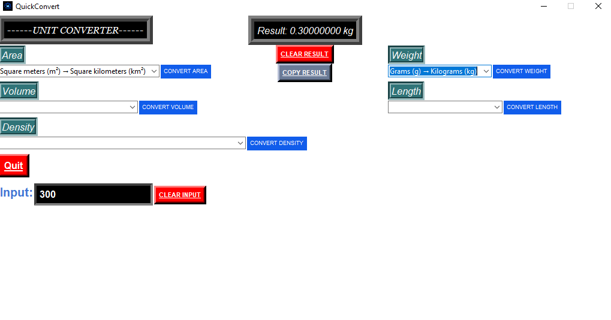

# 🚀 QuickConvert

QuickConvert is a lightweight and easy-to-use Windows desktop application built with **Python** and **Tkinter**. It allows users to quickly convert between different units through a clean graphical interface and super conventional instead of just searching up unit conversions on google

---

## ✨ Features

- 📏 Length Converter
- ⚖️ Weight Converter
- 📐 Area Converter
- 🧪 Density Converter
- 🧴 Volume Converter
- 📋 Copy Result button
- 🗑️ Clear button
- 🖥️ Standalone Windows executable (.exe)
- 🎨 Clean and user-friendly interface

---
## ✨ How To Use
-First put the number you want to convert in the input bar

-Choose the conversion you want related to the unit (ex: under the Area unit you'll find a dropdown menu with a lot of different conversions you can use)

-After you choose the conversion you will find beside the dropdown menu a convert button and make sure to choose the correct convert button related to the unit you want (ex: CONVERT 
AREA)

-After you hit convert you will find your result in the top of the window with its unit!

-You can also use the CLEAR RESULT or CLEAR INPUT buttons to clear any text

---

## 🛠️ Built With

- Python
- Tkinter
- PyInstaller

---

## 📸 Screenshots

### Main Window

### Example Conversion

### Weight Conversion

---

## 📦 Installation

Download the latest release and run the executable.

No Python installation is required.
---
## 💰 Pricing

- Standard Version: $10
- Custom unit additions: +$5 per requested unit

If you need extra measurement units or a custom version for your workflow, feel free to contact me.

---

## 👨‍💻 Author

Created by **Yahya Ahmed**.
